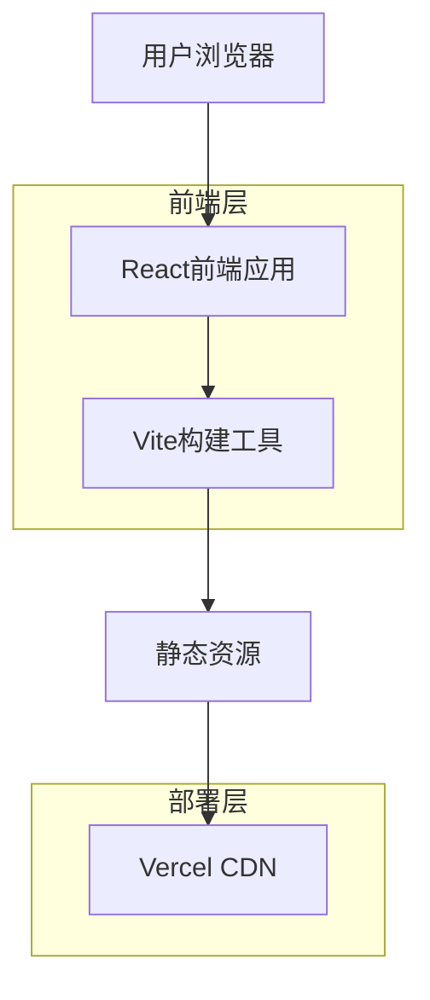

## 1. 架构设计



## 2. 技术描述

- **前端**: React@19 + TypeScript + TailwindCSS
- **初始化工具**: Vite
- **构建工具**: Vite
- **部署平台**: Vercel
- **依赖管理**: npm

### 核心依赖
- react@^19.2.3 - UI框架
- react-dom@^19.2.3 - DOM渲染
- lucide-react@^0.562.0 - 图标库
- typescript@~5.8.2 - 类型系统
- @vitejs/plugin-react@^5.0.0 - React插件
- vite@^6.2.0 - 构建工具

## 3. 路由定义

| 路由 | 目的 |
|-------|---------|
| / | 首页，显示物流服务平台主要内容和导航 |
| /#aftersales | 车后服务页，展示车后市场服务详情 |

## 4. 项目结构

```
guanwang-prototype/
├── components/          # React组件
│   ├── Header.tsx      # 顶部导航组件
│   ├── Footer.tsx      # 底部组件
│   ├── Banner.tsx      # Banner区域组件
│   ├── PlatformModules.tsx  # 平台模块组件
│   ├── StatsSection.tsx     # 数据统计组件
│   ├── LogoTicker.tsx       # Logo轮播组件
│   └── AfterSales.tsx       # 车后服务组件
├── public/             # 静态资源
│   └── logo.png       # 品牌Logo
├── constants.tsx       # 常量定义
├── types.ts           # TypeScript类型定义
├── App.tsx            # 主应用组件
├── index.html         # HTML入口文件
├── index.tsx          # React入口文件
├── vite.config.ts     # Vite配置文件
└── tsconfig.json      # TypeScript配置文件
```

## 5. 部署配置

### Vercel配置 (vercel.json)
```json
{
  "buildCommand": "cd guanwang-prototype && npm run build",
  "outputDirectory": "guanwang-prototype/dist",
  "installCommand": "cd guanwang-prototype && npm install"
}
```

### 构建脚本
- **开发**: `npm run dev` - 启动开发服务器
- **构建**: `npm run build` - 构建生产版本
- **预览**: `npm run preview` - 预览构建结果

## 6. 性能优化

- **代码分割**: 基于路由的代码分割
- **图片优化**: 使用WebP格式，响应式图片
- **CDN加速**: 通过Vercel全球CDN分发
- **缓存策略**: 静态资源长期缓存
- **压缩**: 启用Gzip和Brotli压缩

## 7. 开发环境

### 本地开发
```bash
cd guanwang-prototype
npm install
npm run dev
```

### 环境要求
- Node.js >= 18.0.0
- npm >= 9.0.0