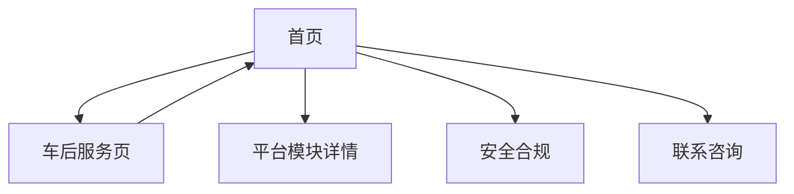

## 1. 产品概述

万连通物流服务平台官网，展示5A级网络货运平台服务能力，提供整车货运全生命周期解决方案。为企业客户提供物流服务平台入口，展示平台规模、服务模块、安全合规保障等核心信息。

## 2. 核心功能

### 2.1 用户角色

| 角色   | 注册方式 | 核心权限                 |
| ---- | ---- | -------------------- |
| 访客用户 | 无需注册 | 浏览官网信息、查看服务介绍、联系咨询   |
| 企业客户 | 线下注册 | 登录平台系统、使用物流服务、查看订单状态 |

### 2.2 功能模块

网站包含以下主要页面：

1. **首页**：企业品牌展示、服务介绍、平台数据统计、合作伙伴展示、安全合规说明
2. **车后服务页**：车后市场服务详细介绍、服务流程、联系方式

### 2.3 页面详情

| 页面名称  | 模块名称     | 功能描述                   |
| ----- | -------- | ---------------------- |
| 首页    | 顶部导航     | 品牌Logo展示、主导航菜单、车后服务入口  |
| 首页    | Banner区域 | 企业slogan展示、核心服务介绍、咨询按钮 |
| 首页    | 平台模块     | 网络货运、车后服务、增值服务三大模块展示   |
| 首页    | 数据统计     | 平台规模数据可视化展示            |
| 首页    | 合作伙伴     | 合作企业Logo轮播展示           |
| 首页    | 安全合规     | 三阶段安全保障体系介绍            |
| 车后服务页 | 服务介绍     | 车后市场服务详细说明             |
| 车后服务页 | 服务流程     | 服务流程步骤展示               |
| 车后服务页 | 联系方式     | 客服联系方式和服务入口            |

## 3. 核心流程

### 访客用户流程

1. 访问官网首页 → 浏览服务介绍 → 查看平台能力 → 点击咨询按钮 → 联系客服
2. 访问首页 → 点击车后服务 → 查看详细服务 → 联系客服

### 页面导航流程

## 4. 用户界面设计

### 4.1 设计规范

* **主色调**：#E60012（红色）、白色、深灰色

* **按钮样式**：圆角矩形、悬停缩放效果、渐变阴影

* **字体**：系统默认无衬线字体，标题加粗，正文常规

* **布局风格**：现代卡片式布局、响应式网格系统

* **图标风格**：简洁线性图标、红色主题色

### 4.2 页面设计概览

| 页面名称  | 模块名称   | UI元素                       |
| ----- | ------ | -------------------------- |
| 首页    | 导航栏    | 白色背景、红色品牌色、Logo+文字组合、下拉菜单  |
| 首页    | Banner | 全屏背景图、深色遮罩、白色文字、红色强调色、渐变按钮 |
| 首页    | 平台模块   | 三栏卡片布局、图标+标题+描述、悬停动画效果     |
| 首页    | 数据统计   | 大数字展示、红色强调、网格布局            |
| 首页    | 合作伙伴   | Logo横向滚动、自动播放、悬停暂停         |
| 首页    | 安全合规   | 深色背景、三阶段展示、红色顶部装饰线         |
| 车后服务页 | 服务介绍   | 图文结合、流程步骤、联系方式卡片           |

### 4.3 响应式设计

* **桌面优先**：基于1920px宽度设计

* **移动端适配**：768px断点，垂直堆叠布局

* **触摸优化**：按钮最小44px点击区域

### 4.4 交互动效

* 页面切换淡入淡出效果

* 按钮悬停缩放和颜色变化

* 滚动时元素渐入动画

* 回到顶部按钮平滑滚动

